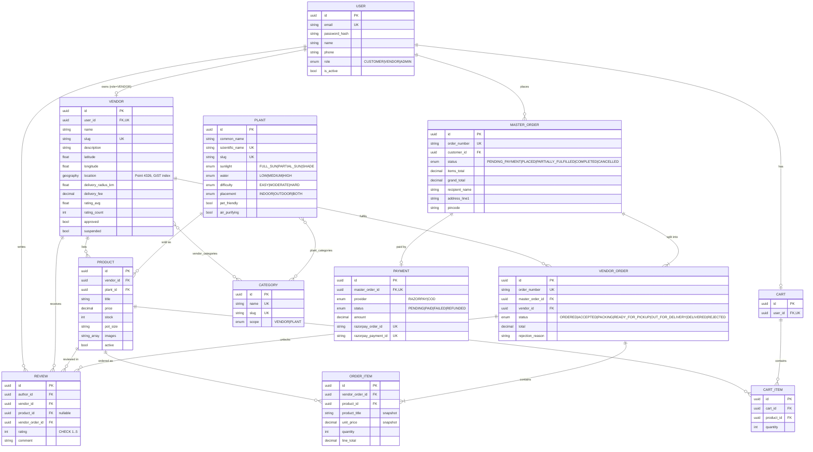
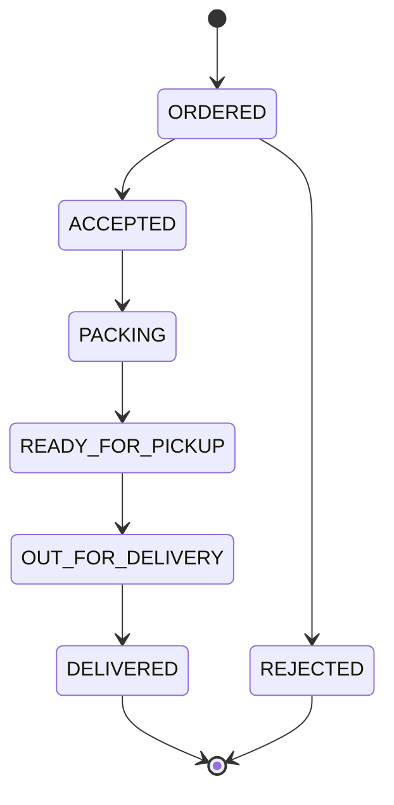

# E-PlantShopping 2.0 — Entity Relationship Diagram

> Renders directly on GitHub. Source of truth is
> [`apps/api/prisma/schema.prisma`](../apps/api/prisma/schema.prisma).

## Order status flow (Step 8 will enforce this)

## Design notes

**1. Two order levels.** A customer checks out once (`MasterOrder`, one payment,
one address) but each vendor works on their own `VendorOrder` with an independent
status. That is what makes the marketplace multi-vendor rather than multi-cart.

**2. `Plant` vs `Product`.** `Plant` is species knowledge (sunlight, water,
difficulty) shared by everyone — it powers search, recommendations and photo
identification. `Product` is one vendor's listing of that species (price, stock,
pot size). Without the split, "20 vendors selling Monstera" would mean 20
inconsistent copies of the care information.

**3. Snapshots on `OrderItem`.** `product_title`, `plant_name` and `unit_price`
are copied at checkout, so a later price change or deleted listing never rewrites
history. Product deletion is additionally blocked by `ON DELETE RESTRICT`.

**4. `latitude`/`longitude` + `location`.** Prisma cannot read or write PostGIS
types, so the canonical lat/lng live in ordinary columns and a `BEFORE INSERT OR
UPDATE` trigger (`sync_vendor_location`) derives the `geography(Point,4326)`
column. Application code only ever touches lat/lng, and the two can never drift.
Spatial queries then use raw SQL with `ST_DWithin` / `ST_Distance` against the
GiST index.

**5. Denormalised `rating_avg` / `rating_count` on `Vendor`.** Nearby-vendor
ranking sorts by distance _and_ rating on every request; recomputing an average
over all reviews each time would not scale. Step 10 updates both counters inside
the same transaction as the review insert.
